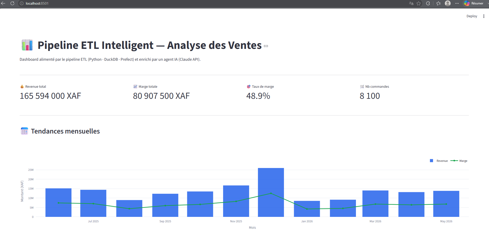
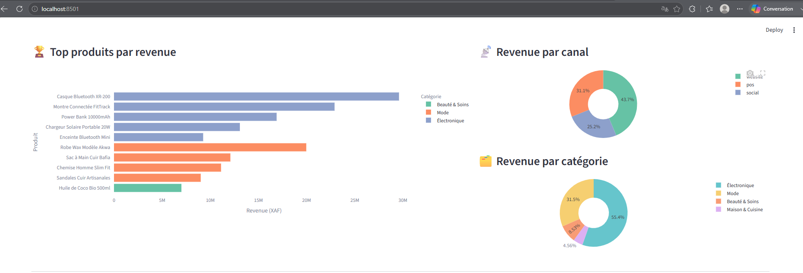
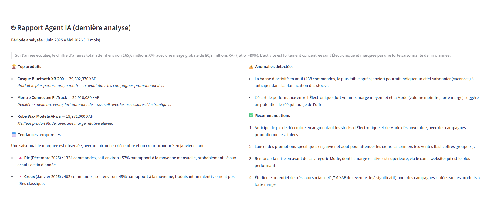
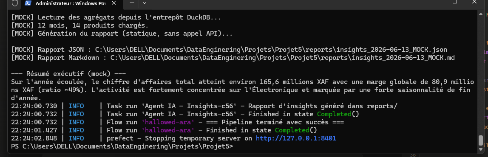
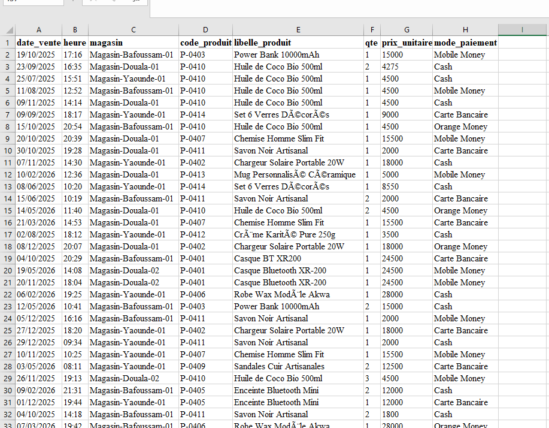
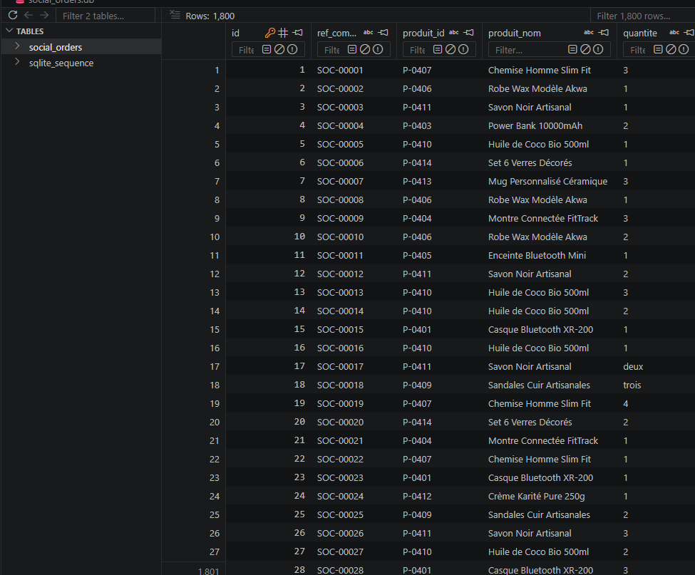

[🇫🇷 Français](README.md) · [🇬🇧 English](README.en.md)

# 📊 Intelligent ETL Pipeline — Sales Analysis with AI Agent

> A complete data pipeline that doesn't just move data around — it reads it, understands it, and tells you what to do with it.



---

## Why this project exists

Most ETL pipelines stop at loading. Data lands in the warehouse, clean and aggregated — and then it's up to a human to analyze it, write a report, spot the anomalies, and formulate recommendations.

This project pushes the logic one step further: once the data is loaded, an **AI agent (Claude via the Anthropic API)** takes over. It queries the warehouse, detects trends and anomalies, and automatically produces a natural language analytical report — structured, actionable, no human intervention required.

It's a classic ETL pipeline, augmented with a layer of intelligence.

---

## What this pipeline actually does

**Input data:** 12 months of e-commerce sales from 3 heterogeneous sources
- `web_orders.json` — website orders (REST API format, with ~2% intentional duplicates)
- `pos_sales.csv` — physical point-of-sale cash register export (noisy labels, missing quantities)
- `social_orders.db` — social media orders in SQLite (prices as text, dates in DD/MM/YYYY format, quantities sometimes written as words: "two", "three"...)

**What the pipeline produces:**
- A clean, unified dataset (8,100 rows after deduplication)
- A DuckDB warehouse with 4 aggregated views (by month, product, category, channel)
- An AI report in JSON + Markdown with top products, trends, anomalies, recommendations
- An interactive Streamlit dashboard readable by non-technical business users

---

## Architecture

```
generate_data.py          ← generates the 3 simulated data sources
        │
        ▼
src/extract.py            ← reads the 3 sources → unified schema (8 columns)
        │
        ▼
src/transform.py          ← cleaning, normalization, deduplication, catalog enrichment
        │
        ▼
src/load.py               ← loads into DuckDB + creates 4 aggregated views
        │
        ▼
src/agent_insights.py     ← Claude agent: analyzes aggregates → JSON + Markdown report
        │
        ▼
dashboard.py              ← Streamlit dashboard (KPIs, charts, AI report)

pipeline.py               ← orchestrates everything with Prefect (@flow + @task + retries)
```

---

## Tech stack

| Layer | Technology |
|---|---|
| Extraction | Python, pandas, sqlite3 |
| Transformation | pandas |
| Loading | DuckDB |
| Orchestration | Prefect |
| AI Agent | Anthropic API (Claude Sonnet) |
| Dashboard | Streamlit + Plotly |
| Language | Python 3.11 |

---

## Screenshots

### Dashboard — Global view (KPIs + monthly trends)


*The December spike (+57% vs monthly average) and January dip (-49%) are immediately visible.*

### Dashboard — Top products & breakdown


### AI Agent-generated report


### Prefect pipeline — Full execution


### Source data — Point of Sale (CSV)


### Source data — Social media orders (SQLite)


---

## Installation and setup

### Prerequisites
- Python 3.11+
- Git

### 1. Clone the repo
```bash
git clone https://github.com/Mozaar007/pipeline-etl-agent-ia.git
cd pipeline-etl-agent-ia
```

### 2. Install dependencies
```bash
pip install -r requirements.txt
```

### 3. Set up your API key (optional — for the real AI agent)
Create a `.env` file at the root:
```
ANTHROPIC_API_KEY=sk-ant-your-key-here
```

### 4. Generate source data
```bash
python generate_data.py
```

### 5. Run the full pipeline

**With mock agent (no API credit needed):**
```bash
python pipeline.py --mock
```

**With real AI agent (Claude API):**
```bash
python pipeline.py
```

### 6. Launch the dashboard
```bash
streamlit run dashboard.py
```
Opens automatically at `http://localhost:8501`

---

## Repository structure

```
pipeline-etl-agent-ia/
├── src/
│   ├── extract.py              ← reads and unifies the 3 sources
│   ├── transform.py            ← cleaning and enrichment
│   ├── load.py                 ← DuckDB loading + aggregated views
│   ├── agent_insights.py       ← AI agent (Claude API)
│   └── agent_insights_mock.py  ← mock version (no API credit needed)
├── data/
│   ├── products.csv            ← product catalog (master reference)
│   ├── raw/                    ← raw source data
│   └── processed/              ← intermediate datasets (gitignored)
├── reports/                    ← AI-generated reports (JSON + Markdown)
├── assets/                     ← screenshots and visuals
├── notebooks/                  ← exploration scripts
├── pipeline.py                 ← Prefect orchestration
├── dashboard.py                ← Streamlit dashboard
├── generate_data.py            ← simulated data generator
├── requirements.txt
└── .env.example
```

---

## Deliberate design decisions

**DuckDB over PostgreSQL**: no server to install, single portable file, SQL syntax identical to Postgres. Anyone who clones the repo can run the pipeline in under 2 minutes with zero configuration.

**Simulated but realistic data**: the 3 sources have deliberately heterogeneous schemas (different date formats, prices as text, quantities as words, noisy labels) to make the transformation work demonstrable and non-trivial.

**Missing quantities imputed to 1**: the ~15 POS rows with missing quantity are imputed to 1 (assumption: single-unit sale, the most frequent case). This is a documented modeling decision, not an oversight.

**Full refresh loading**: `load.py` recreates the table on every run. In a production incremental pipeline, an upsert strategy would be appropriate. This is an acknowledged limitation for this demo.

---

## Key results (12 months)

- **Total revenue:** 165,594,000 XAF
- **Total margin:** 80,907,500 XAF (rate: 48.9%)
- **Orders processed:** 8,100 (after removing 73 duplicates)
- **Seasonal peak:** December 2025 (+57% vs average)
- **Seasonal trough:** January 2026 (-49% vs average)
- **Dominant channel:** Website (43.7% of revenue)
- **Most profitable category:** Fashion (54% margin rate vs 43% for Electronics)

---

## Contact

**Bobby Mozaar — BigIcks Consulting**
Agency specialized in AI agents and intelligent automation for francophone African institutions.

- 📧 smozaar@gmail.com
- 📱 +237 673 687 079
- 🐙 [github.com/Mozaar007](https://github.com/Mozaar007)

---

*Data generated for demonstration purposes. This project is part of a 38-project roadmap in Data Engineering and AI.*
